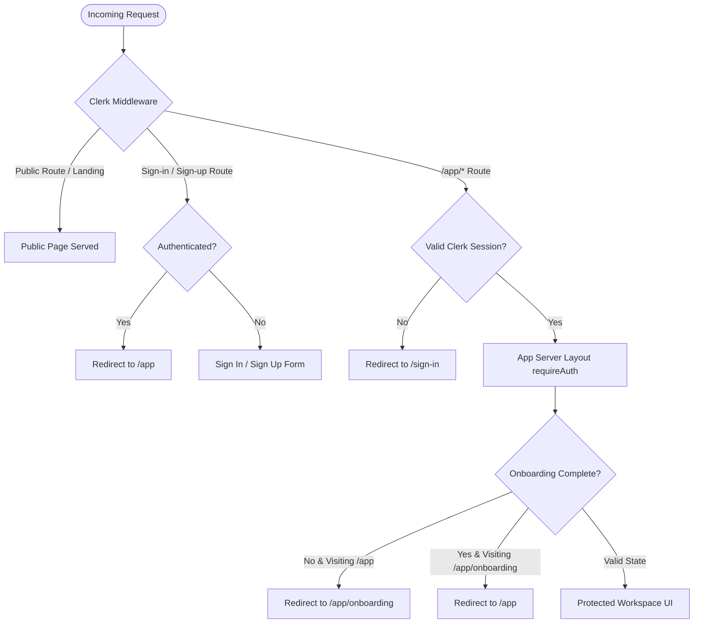

# AI Confidence Coach — System Architecture & Technical Specification

## 1. Executive Summary & Philosophy
**AI Confidence Coach** is a production-grade web application engineered to cultivate measurable personal and professional confidence through structured cognitive-behavioral coaching, real-time intent analysis, micro-action accountability, and automated weekly email digests.

The application strictly decouples business logic from external orchestration workflows (e.g. n8n), natively implementing all pipelines within Next.js App Router services, typed server actions, and route handlers.

---

## 2. Technology Stack

| Layer | Technology | Purpose / Configuration |
| :--- | :--- | :--- |
| **Framework** | Next.js 15+ (App Router) | Server components, route groups, streaming completions, API route handlers |
| **Language** | TypeScript (Strict Mode) | Zero `any` policy, `noUncheckedIndexedAccess`, exhaustive schema types |
| **Styling & Tokens** | Tailwind CSS + CSS Variables | Bespoke dark minimalist palette, system-ui typography, 1px borders |
| **Component Primitives** | Custom atomic UI (shadcn style) | Button, Card, DenseRow, Switch, Table, Badge, Separator |
| **Authentication** | Clerk Auth (`@clerk/nextjs` v6) | User management, session cookies, route middleware, server-side JWT verification |
| **Database & ORM** | Neon PostgreSQL + Drizzle ORM | Serverless Postgres connection, relational schema definitions |
| **Intelligence Engine** | NVIDIA NIM API (`meta/llama-3.1-70b`) | Intent classification, structured coaching responses, weekly synthesis |
| **Email Delivery** | Resend & Gmail SMTP (Nodemailer) | Pluggable dual-adapter delivery system for weekly digests & notifications |
| **Job Scheduling** | Vercel Cron | Scheduled weekly trigger endpoints with bearer token validation |
| **Validation** | Zod | Runtime payload parsing, client/server environment variable isolation |

---

## 3. Visual Language & Design System

The interface adheres to an exact dark-mode palette without gradients, glassmorphism, or neon accents:
- **Background**: `#0d0d0d`
- **Panel / Surface**: `#161616`
- **Secondary Surface**: `#1c1c1c`
- **Hover Surface**: `#242424`
- **Border**: `#2a2a2a` (1px subtle division)
- **Primary Text**: `#e8e8e8`
- **Secondary Text**: `#8a8a8a`
- **Muted Text**: `#5c5c5c`
- **Accent**: `#e07856` (Warm terracotta)
- **Success**: `#3ecf5e`
- **Danger**: `#e5484d`

**Typography**: Native `system-ui` font stack (`-apple-system`, `BlinkMacSystemFont`, `Segoe UI`, `Roboto`), body `13.5px`, h1 `22px/600`, dense settings-style table and row layouts.

---

## 4. Authentication Architecture & Identity Model

### 4.1 Clerk Responsibility
Clerk (`@clerk/nextjs` v6) operates as the authoritative identity provider, managing:
1. **User Lifecycle & Credentials**: Multi-factor authentication, email verification, social OAuth, session rotation, and passwordless flows.
2. **Session Token Issuance**: Secure HttpOnly JWT session tokens delivered to the browser and verified on the server.
3. **Session Verification**: Server-side JWT decoding via `auth()` and `currentUser()` in Next.js Server Components, Server Actions, and Route Handlers.

### 4.2 Application Identity Model
- **Canonical Key**: The Clerk `userId` (e.g. `user_2...`) is the immutable, canonical primary key across the entire application domain (`users.id` and `profiles.userId`).
- **Zero-Trust Identity Derivation**: User identity is **never** accepted from client-controlled payloads (request body, URL search parameters, path segments, or hidden form inputs). Identity is strictly derived on the server from the verified Clerk session.
- **User Synchronization Layer (`src/lib/auth/sync-user.ts`)**: On first authenticated access, `ensureUserProfile()` verifies or provisions the local application user record (`users` table) without duplicating records, synchronizing `id`, `email`, `fullName`, and `imageUrl`.

### 4.3 User States & Routing Flow



### 4.4 Authentication State Definitions

| State | Condition | Route Access | Behavior |
| :--- | :--- | :--- | :--- |
| **State A: Unauthenticated** | No valid Clerk session | Public pages (`/`, `/features`, `/pricing`, etc.) & Auth pages (`/sign-in`, `/sign-up`) | Accessing `/app/*` redirects to `/sign-in?redirect_url=...`. Accessing private API endpoints returns `401 Unauthorized`. |
| **State B: Authenticated (Incomplete Onboarding)** | Valid Clerk session, no completed profile | `/app/onboarding`, `/api/onboarding`, public pages | Accessing `/app` redirects to `/app/onboarding` for initial 3-step cognitive calibration intake. |
| **State C: Authenticated (Complete Onboarding)** | Valid Clerk session, completed profile record | All `/app/*` routes, all `/api/*` endpoints | Direct access to workspace dashboard, AI coach, progress analytics, check-ins, and settings. |

---

## 5. Route Architecture

```
/
├── (marketing)
│   ├── /                          # Product landing page & architecture overview
│   ├── /features                  # Capability breakdown
│   ├── /how-it-works              # Step-by-step coaching methodology
│   ├── /pricing                   # Transparent tier options
│   ├── /about                     # Mission statement & principles
│   ├── /privacy                   # Privacy & confidential data policy
│   └── /terms                     # Terms of service
├── (auth)
│   ├── /sign-in/[[...sign-in]]    # Clerk authentication login
│   └── /sign-up/[[...sign-up]]    # Clerk registration
├── (app)                          # Authenticated workspace group (Protected)
│   ├── /app                       # Overview dashboard & quick metrics
│   ├── /app/onboarding            # 3-step baseline calibration intake
│   ├── /app/coach                 # Real-time AI coaching workspace
│   ├── /app/coach/history         # Historical session ledger
│   ├── /app/coach/c/[id]          # Session transcript viewer
│   ├── /app/progress              # Growth metrics & domain progression
│   ├── /app/check-ins             # Weekly digest archives
│   ├── /app/profile               # Confidence calibration summary
│   └── /app/settings              # Workspace settings hub
│       ├── /                      # General settings
│       ├── /profile               # Profile calibration editor
│       ├── /email                 # Dual email provider connector & test tool
│       └── /preferences           # Coaching tone & notification switches
└── api
    ├── /api/chat                  # AI coaching completion endpoint (Protected)
    ├── /api/onboarding            # Intake profile intake handler (Protected)
    ├── /api/profile               # Profile GET / PATCH handler (Protected)
    ├── /api/conversations         # Conversation list & create handler (Protected)
    ├── /api/email/test            # Test email dispatch handler (Protected)
    ├── /api/email/connect         # Email provider connection handler (Protected)
    ├── /api/email/disconnect      # Email provider teardown handler (Protected)
    └── /api/cron/weekly-checkin   # Vercel Cron scheduled trigger handler (Bearer Token)
```

---

## 6. Service Boundaries & Data Flow

```mermaid
flowchart TD
    User([User Browser / Client])
    Middleware[Clerk Middleware Guard]
    ChatRoute[/api/chat Route Handler]
    CronRoute[/api/cron/weekly-checkin]
    
    subgraph Core Services
        AuthService[lib/auth: requireAuth & getCurrentUser]
        SyncService[lib/auth/sync-user: ensureUserProfile]
        CoachingService[lib/coaching: Intent & Memory]
        AIService[lib/ai: NVIDIA NIM Client]
        EmailService[lib/email: Resend & Gmail SMTP]
        DBService[db: Drizzle + Neon Postgres]
    end

    User -->|HTTP / React UI| Middleware
    Middleware -->|Protected Route| ChatRoute
    ChatRoute --> AuthService
    AuthService --> SyncService
    SyncService --> DBService
    ChatRoute --> CoachingService
    CoachingService --> AIService
    AIService -->|Structured JSON| ChatRoute
    ChatRoute --> DBService

    VercelCron[Vercel Cron Service] -->|Bearer CRON_SECRET| CronRoute
    CronRoute --> CoachingService
    CoachingService --> AIService
    CronRoute --> EmailService
    EmailService -->|Dispatched Email| Inbox([User Email Inbox])
```

### 6.1 AI Coaching Engine (`src/lib/ai`)
- Wraps the OpenAI-compatible NVIDIA NIM API endpoint (`meta/llama-3.1-70b-instruct`).
- Employs strict system prompts parameterized by user profile context.
- Implements two-stage output handling: structured JSON extraction with automated fallback to prevent chat disruption.

### 6.2 Email Delivery Layer (`src/lib/email`)
- Implements the `EmailProviderAdapter` interface.
- **ResendEmailAdapter**: Direct API communication for modern transactional delivery.
- **GmailSmtpEmailAdapter**: Nodemailer integration using Google App Passwords.
- Central factory `getEmailProvider()` automatically selects the configured provider based on environment variables or user settings.

### 6.3 Scheduled Check-in Engine (`src/lib/coaching/checkin-engine.ts`)
- Scheduled via `/api/cron/weekly-checkin`.
- Aggregates the user's weekly conversation activity.
- Generates a 3-part digest: Reflection Summary, Micro-Action Experiments, and a Deep Coach Question.
- Renders an email template matching the application's visual tokens and sends it via the active email adapter.

---

## 7. Security Boundaries & Protection Strategy

1. **Multi-Tier Route Protection**:
   - **Edge Middleware (`middleware.ts`)**: Fast boundary checks redirecting unauthenticated requests away from `/app/*` and redirecting authenticated users away from `/sign-in` and `/sign-up`.
   - **Server Component Layout Guard (`src/app/(app)/layout.tsx`)**: Enforces `requireAuth()` server-side during SSR.
   - **Route Handler Guard (`requireApiAuth`)**: Rejects unauthenticated API calls with standard `401 Unauthorized` responses.
2. **Environment Isolation**: Server secrets (`CLERK_SECRET_KEY`, `NVIDIA_NIM_API_KEY`, `RESEND_API_KEY`, `GMAIL_APP_PASSWORD`, `CRON_SECRET`, `DATABASE_URL`) are isolated via `src/config/env.ts` with explicit runtime checks preventing client bundle leakage.
3. **Cron Authentication**: The cron endpoint requires an `Authorization: Bearer <CRON_SECRET>` header verified by `src/lib/security/cron-auth.ts`.
4. **Input Validation**: All user inputs are strictly validated against Zod schemas (`src/lib/validation/`).

---

## 8. Future Extensibility
- **Database Persistence**: Tables are fully defined in `src/db/schema/` ready for `drizzle-kit push` or migrations.
- **Voice Coaching**: Feature flags (`src/config/features.ts`) are pre-wired to enable WebRTC/Audio streaming coaching models.
- **Advanced Analytics**: Metrics schemas support longitudinal sentiment and confidence progression tracking.
